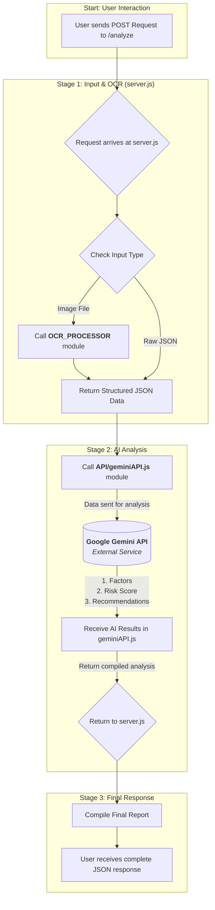
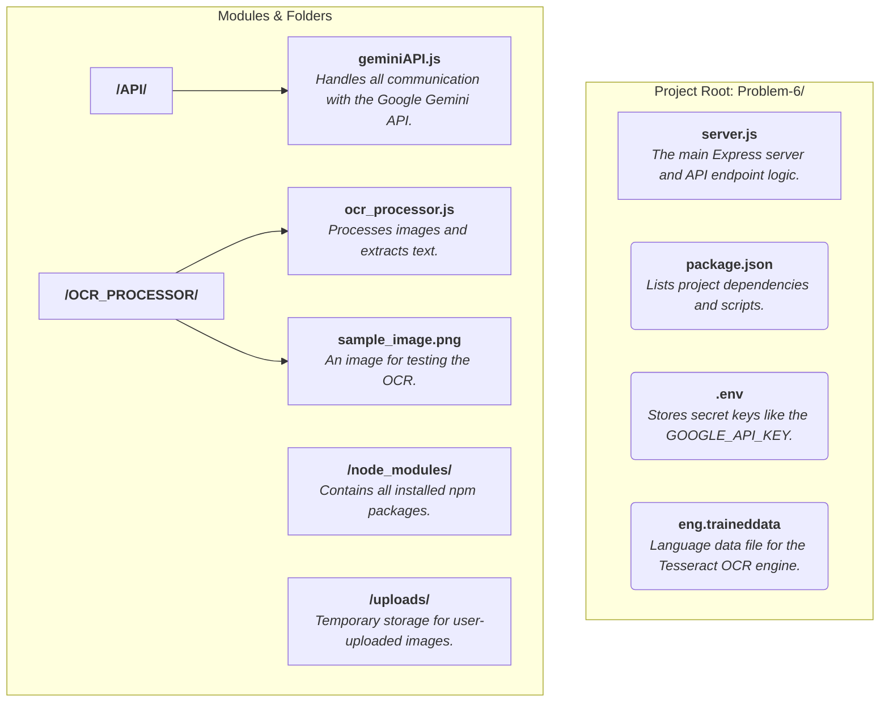

🤖 AI-Powered Health Risk Profiler
====================================
📜1.Overview
--------------------------
This project is an intelligent data-processing engine built to transform raw health survey data into actionable insights. It features a versatile dual-input system, capable of ingesting survey information from either image files—processed through an integrated OCR pipeline—or directly via a JSON payload.

Once the data is structured, the service leverages the Google Gemini AI in a sophisticated, multi-stage analytical process. This workflow goes beyond a single query, executing a chain of tasks:

It first identifies key lifestyle risk factors from the raw text.

Next, it classifies the overall risk with a numerical score and rationale.

Finally, it generates personalized, actionable recommendations to address the identified risks.

The entire process is wrapped in a robust REST API using Node.js and Express, delivering a predictable and comprehensive JSON report ideal for integration into any web or mobile frontend.

🏗️2.Project Architecture & Flow
 -----------------------------------
The application is built on a modular architecture that separates concerns for clarity and maintainability. The following diagrams illustrate the project's data flow and code structure.

Project Flow (Mind Map)

This mind map shows the complete data flow from the initial user request to the final AI-generated report.

Project Structure (Mind Map)
-------------------------------------------
This diagram visualizes the structure of the project, with brief explanations for each key file and folder


🚀3.Setup and Installation
----------------------------------------
Prerequisites
Node.js (v16+ recommended)

NPM (included with Node.js)

A Google Gemini API Key

Step-by-Step Setup
Clone the Repository:

git clone <[https://github.com/Likhith0123/Health-Risk-Profiler.git](https://github.com/Likhith0123/Health-Risk-Profiler.git)>
cd Problem-6


Install Dependencies:
Run this command to install all necessary libraries from package.json:

npm install

Configure Environment Variables:

In the root of the project, create a new file named .env.

Obtain an API key from Google AI Studio.

Add the key to your .env file:

GOOGLE_API_KEY=AIzaSy...your_personal_api_key_here

🏃4.How to Run the Application
------------
To start the API server, run the following command from the project's root directory:

 node server.js

The server will start and listen for requests on 

http://localhost:3000

 📚5.API Reference
------------------
This section provides a detailed reference for using the API.

Endpoint: POST /analyze
This single endpoint processes all survey data.

Option A: Analyze an Image
Use this method to send an image file for OCR and analysis.

Method: POST

URL: http://localhost:3000/analyze

Body: form-data

Key: surveyImage

Type: File

Value: Select your survey image file.

Example curl command:

curl -X POST -F "surveyImage=@OCR_PROCESSING/sample_image.png" http://localhost:3000/analyze

Option B: Analyze Raw JSON Data
Use this method to send survey data directly as a JSON object, bypassing the OCR step.

Method: POST

URL: http://localhost:3000/analyze

Headers: Content-Type: application/json


Body: raw (JSON)

{
  "age": 58,
  "smoker": false,
  "exercise": "I walk for 30 minutes most mornings",
  "diet": "My diet is balanced but I have a sweet tooth",
  "alcohol": "A glass of wine a couple times a week",
  "sleep": "I usually get about 6 hours of sleep"
}

Example curl command:

curl -X POST -H "Content-Type: application/json" -d '{"age": 58, "smoker": false, "exercise": "I walk daily"}' http://localhost:3000/analyze

✅Success Response (  200 OK )
----------------------
A successful analysis returns a JSON object with the full report.

Example Body:


❌Error Response ( 400 Bad Request )
------------------
Example Body:


🧠6.AI Prompt
------------------
The core of the analysis is controlled by the system prompts sent to the Google Gemini API.
Certainly. Here is a revised breakdown of the prompts, explaining what each one does and how it aligns with the specific functions and required JSON schemas in your geminiAPI.js code.

## Prompt 1: Get Risk Factors
Purpose: This initial prompt takes the raw survey data (e.g., "exercise": "I walk sometimes") and summarizes it into a list of clear, professional phrases.

Used in Function: identifyRiskFactors(surveyData)

**Required JSON Output:**
{
  "risk_factors": ["string", "string", ...]
}

Prompt Text:

You are a health data summarizer. For each lifestyle habit provided, identify the key factor and describe it in a clear, professional phrase (e.g., 'High sugar intake', 'Lack of physical activity'). You must summarize every category provided. Your response MUST be a single, valid JSON object with a single key, 'risk_factors', which is a list of these summary strings.

## Prompt 2: Risk Classification
Purpose: This prompt analyzes the list of risk factors generated by the first step to calculate a numerical score and determine an overall risk category.

Used in Function: classifyOverallRisk(riskFactors)

**Required JSON Output:**
{
  "risk_level": "string",
  "score": "number",
  "rationale": ["string", ...]
}

Prompt Text:

You are a health risk classification engine. Your task is to analyze a list of lifestyle factors. Based on these factors, you must calculate a numerical score between 0 and 95, determine an overall risk_level ('low', 'medium', 'high'), and provide a rationale (a list of the primary factors). Your response MUST be a single, valid JSON object with the keys risk_level, score, and rationale.

## Prompt 3: Get Recommendations
Purpose: This final prompt uses the list of risk factors to generate a full report that includes personalized, actionable advice for the user.

Used in Function: generatePersonalizedRecommendations(riskFactors)

**Required JSON Output:**
{
  "risk_level": "string",
  "factors": ["string", ...],
  "recommendations": ["string", ...],
  "status": "string"
}

Prompt Text:

You are an expert health analyst. Your task is to analyze a user's survey responses. Based on the data, you must determine an overall risk_level, list the key factors, provide a simple recommendation for each factor, and set a status field to 'ok'. Your response MUST be a single, valid JSON object with the keys risk_level, factors, recommendations, and status.

Of course. Here is a file tree structure that accurately represents your final project, formatted in a similar style.

-----

## Project Structure

```
AI-Health-Profiler/
├── server.js               # Main Express server with the /analyze endpoint.
├── package.json            # Lists all project dependencies and scripts.
├── .env                    # Stores the secret Google Gemini API key.
├── .gitignore              # Tells Git which files and folders to ignore.
├── eng.traineddata         # Language data file for the Tesseract OCR engine.
|
├── /API/
│   └── geminiAPI.js        # Handles all communication with the Google Gemini API.
|
├── /OCR_PROCESSOR/
│   ├── ocr_processor.js    # Handles image processing and OCR logic.
│   └── sample_image.png    # An example image for testing the OCR.
|
└── /uploads/
    └── (empty)             # Temporary storage for user-uploaded images.
```
